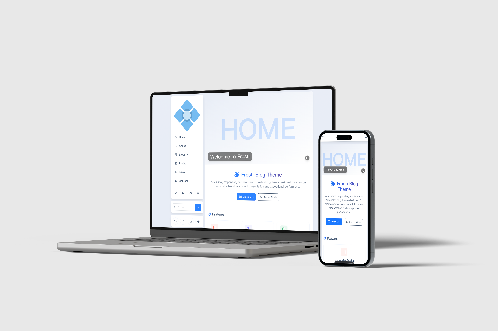

# 💠 Frosti v3

[](https://github.com/EveSunMaple/Frosti/blob/main/LICENSE)&nbsp;&nbsp;&nbsp;[](https://github.com/EveSunMaple/Frosti/releases)&nbsp;&nbsp;&nbsp;[](https://stackblitz.com/github/EveSunMaple/Frosti)

<pre align="center">
A clean, elegant, and fast static blog template! 🚀 Built with Astro
</pre>

[**🖥️ Frosti Demo**](https://frosti.saroprock.com)&nbsp;&nbsp;&nbsp;/&nbsp;&nbsp;&nbsp;[**🌏 Chinese README**](https://github.com/EveSunMaple/Frosti/blob/main/README.zh-CN.md)&nbsp;&nbsp;&nbsp;/&nbsp;&nbsp;&nbsp;[**❤️My Blog**](https://www.saroprock.com)



## ✨ Features

- ✅ **Light** / **Dark** mode available
- ✅ Super fast performance with excellent SEO
- ✅ View transition animations (using ClientRouter)
- ✅ Search functionality for your articles (using Pagefind)
- ✅ Responsive design built with [Tailwind CSS](https://tailwindcss.com/) and [daisyUI](https://daisyui.com/)
- ✅ RSS feed support
- 🛠️ Easy to use blog
  - Installation with just one command
  - Customize your blog content in `frosti.config.yaml`

## ✒️ Article Information

|    Name     |       Meaning       | Required |
| :---------: | :-----------------: | :------: |
|    title    |    Article title    |   Yes    |
| description | Article description |   Yes    |
|   pubDate   |  Publication date   |   Yes    |
|    image    | Article cover image |    No    |
| categories  | Article categories  |    No    |
|    tags     |    Article tags     |    No    |
|    badge    |    Article badge    |    No    |
|    draft    |    Draft status     |    No    |

> [!TIP]
>
> - You can pin your article by setting the `badge` property to `Pin`
> - Setting `draft: true` will mark the article as a draft, and it won't appear in the article list

## ⬇️ Usage

1. Install pnpm package manager (if you haven't already)

```sh
npm i -g pnpm
```

2. Clone the project

```sh
git clone --depth 1 https://github.com/EveSunMaple/Frosti.git Frosti
```

3. Enter the project folder

```sh
cd Frosti
```

4. Install dependencies

```sh
pnpm i
```

5. Debug and run the project

```sh
# If this is your first deployment, build first
pnpm run build

pnpm run dev
```

> [!NOTE]
> You must build before starting the debug server, otherwise pagefind won't have an index, and the search functionality will not work.

## 🔧 Configuration

Frosti uses `frosti.config.yaml` as its configuration file, where you can configure the website's basic information, navigation bar, footer, and more.

### Website Basic Information (site)

```yaml
site:
  tab: Frosti # Text displayed in the browser tab
  title: Frosti # Website title
  description: A clean, elegant, and fast static blog template! # Website description for SEO
  language: en # Website language code, e.g., "en" for English, "zh" for Chinese
  favicon: /favicon.ico # Website favicon path
```

### Theme Settings (theme)

```yaml
theme:
  light: winter # Light mode theme, based on daisyUI themes
  dark: dracula # Dark mode theme, based on daisyUI themes
  code: github-dark # Code block theme style
```

- Themes are based on options provided by [daisyUI](https://daisyui.com/docs/themes/)
- Code block themes use styles from [Shiki](https://shiki.style/themes)

### Date Format (date_format)

```yaml
date_format: ddd MMM DD YYYY # Date display format
```

### Menu Configuration (menu)

```yaml
menu:
  - id: home # Unique identifier for the menu item
    text: Home # Text displayed in the menu
    href: / # Link address
    svg: "material-symbols:home-outline-rounded" # Icon
    target: _self # Link target
```

Each menu item includes the following properties:

- `id`: Unique identifier
- `text`: Displayed text
- `href`: Link address
- `svg`: Icon code using [Iconify](https://icon-sets.iconify.design/) icon set
- `target`: Link target (`_self` for current window or `_blank` for new window)

#### Sub-menu Items (subItems)

You can configure sub-menu items by adding `subItems` with the same format as main menu items.

### User Information (user)

```yaml
user:
  name: EveSunMaple # Username
  site: "https://example.com" # User website
  avatar: /profile.png # User avatar
```

### Social Media Configuration (social)

Sidebar and footer can have different social media links:

```yaml
sidebar:
  social:
    - href: "https://github.com/username" # Link address
      ariaLabel: Github # Accessibility label
      title: Github # Tooltip on hover
      svg: "ri:github-line" # Icon code
```

### Icon Settings (icon)

Frosti uses [Iconify](https://icon-sets.iconify.design/) as its icon library. You can search for icons you like on their website, then copy the icon code to the `svg` field in the configuration file.

### Language Settings (language)

Frosti supports multiple languages, configured through:

1. Setting the default language in `frosti.config.yaml`:

```yaml
site:
  language: en # Set to "en" for English, "zh" for Chinese
```

2. Managing all interface text translations in the `src/i18n/translations.yaml` file:

```yaml
en: # English translations
  label:
    noTag: No tags assigned
    tagCard: Tags
    # Other English labels...

zh: # Chinese translations
  label:
    noTag: 未分配标签
    tagCard: 标签
    # Other Chinese labels...
```

#### Adding or Modifying Translations

To add new language support or modify existing translations:

1. Add a new language code and corresponding translations in the `translations.yaml` file, or modify existing translations
2. Change `site.language` in `frosti.config.yaml` to your preferred language code

## 👀 Issues

If you have any questions or suggestions, you can provide feedback or communicate with the developer by submitting Issues!

## 🎉 Acknowledgements

@[Saicaca](https://github.com/saicaca) Their inspiration was the main reason I created this theme

@[WRXinYue](https://github.com/WRXinYue) They helped me a lot when I was first getting started
